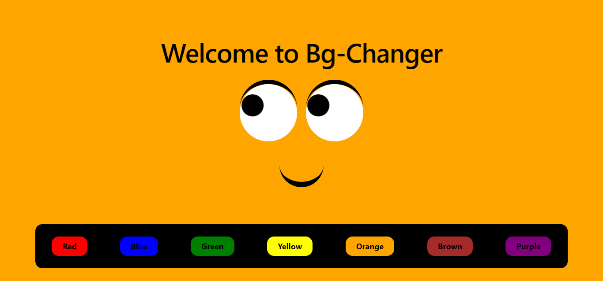

# bgChanger Site

Welcome to the bgChanger site repository! This project is built using Vite, React, and JavaScript. With this project, you can change the background of your site dynamically.

## Preview

## Getting Started

To get started with this project, follow these steps:

1. Clone this repository to your local machine.
2. Install dependencies by running `npm install`.
3. Run the project using `npm run dev`.
4. Open your browser and navigate to `http://localhost:3000` to see the bgChanger site in action.

## Features

- Dynamic Background Change: Change the background of the site with a click.
- [Add More Features Here...]

## Contributing

If you want to contribute to this project, feel free to fork the repository and submit a pull request with your changes. Contributions are welcome!

## Credits

This project is maintained by [softengrmuhammadnabeel](https://github.com/softengrmuhammadnabeel).

## License

This project is licensed under the [MIT License](LICENSE).
